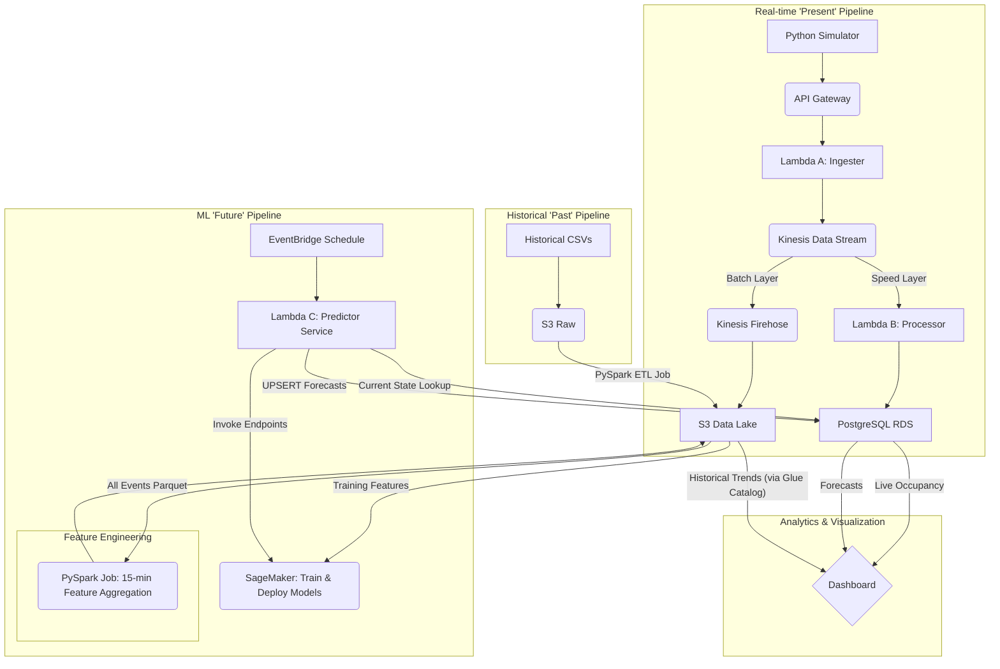

# SFU Parking Insights - End-to-End Data Pipeline

This project is a complete, end-to-end data pipeline built on AWS to provide "Past" (historical), "Present" (real-time), and "Future" (predictive) parking insights for Simon Fraser University (SFU).

The primary goal is to solve the problem of unpredictable parking availability by creating a single source of truth for lot occupancy, which is then used to power a live dashboard and train forecasting models.

## Architecture Overview

The system is a hybrid real-time and batch architecture (Lambda Architecture).

1.  **Real-time (Speed Layer):** A live stream of `ARRIVAL` and `DEPARTURE` events is processed instantly and stored in a PostgreSQL database to provide sub-second query results for the "Present" occupancy dashboard.
2.  **Batch Layer:** All data (both historical and real-time) is also converted to Apache Parquet and stored in a partitioned S3 data lake. This serves as the permanent, low-cost source of truth for "Past" analytics and "Future" model training.

## Core Components
### AWS Services
- **API Gateway (HTTP API):** The public-facing endpoint to receive JSON parking events.
- **AWS Lambda (x2):**
  - **Lambda A (Ingester):** Validates, standardizes, and puts events onto the Kinesis stream.
  - **Lambda B (Processor):** Reads events from Kinesis and runs an atomic `UPSERT` query on the PostgreSQL database to update the live count.
- **Amazon Kinesis Data Stream:** A real-time data buffer that decouples the ingester from the processing forks.
- **Amazon Kinesis Data Firehose:** Reads from the Kinesis Stream, converts JSON to Parquet, and saves the partitioned data to S3.
- **Amazon S3:** The data lake, storing raw historical CSVs and all processed Parquet data.
- **Amazon RDS (PostgreSQL):** The "Speed Layer" database. Stores only the current occupancy count for each lot.
- **AWS Glue Data Catalog:** Provides the schema that Firehose uses for Parquet conversion and that Athena uses for querying.
- **AWS EMR (Apache Spark):** Used for the one-time batch ETL job (`sfu_parking_etl.py`) to process historical CSVs.
- **VPC & Networking:** All components are secured in a private VPC. A **Kinesis VPC Endpoint** is used to allow the private Lambdas to access the Kinesis API.

### Pyhton Scripts
- `generate_real_time_data.py`: A local Python script that simulates live parking events and sends them to the API Gateway.
- `sfu_parking_etl.py`: A PySpark job that batch-processes the historical CSVs into Parquet.
- `lambda_ingester_validator.py`: Code for Lambda A.
- 'lambda_kinesis_processor.py`: Code for Lambda B (requires a psycopg2 deployment package).

## Project Insights
This architecture successfully answers the project's three main questions:
- **"Past" Insights:** Answered by running **Amazon Athena** queries against the S3 data lake `(/processed/historical/ and /raw/realtime/)`.
- **"Present" Insights:** Answered by querying the **PostgreSQL** `current_lot_occupancy` table, which is updated live by Lambda B.
- **"Future" Insights:** Generated by training a machine learning model (e.g., in SageMaker or EMR) on the complete Parquet dataset in S3.

