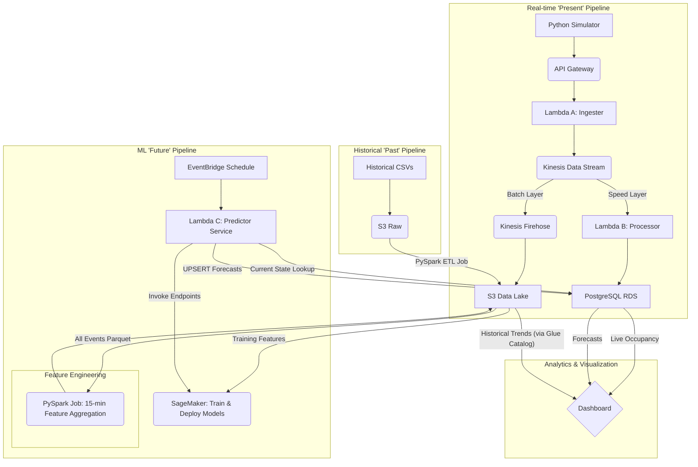

# SFU Parking Insights - End-to-End Data Pipeline

This project is a complete, end-to-end data pipeline built on AWS to provide "Past" (historical), "Present" (real-time), and "Future" (predictive) parking insights for Simon Fraser University (SFU).

The primary goal is to solve the problem of unpredictable parking availability by creating a single source of truth for lot occupancy, which is then used to power a live dashboard and train forecasting models.

## Architecture Overview

The system is a hybrid real-time and batch architecture (Lambda Architecture).

1.  **Real-time (Speed Layer):** A live stream of `ARRIVAL` and `DEPARTURE` events is processed instantly and stored in a PostgreSQL database to provide sub-second query results for the "Present" occupancy dashboard.
2.  **Batch Layer:** All data (both historical and real-time) is also converted to Apache Parquet and stored in a partitioned S3 data lake. This serves as the permanent, low-cost source of truth for "Past" analytics and "Future" model training.
3.  **Predictive Layer (Future):** A scheduled Lambda function fetches the current state, invokes two deployed SageMaker Endpoints for forecasting, and stores the resulting predictions (occupancy count and departure count) back into the PostgreSQL database.



## Core Components
### AWS Services
- **API Gateway (HTTP API):** The public-facing endpoint to receive JSON parking events.
- **AWS Lambda (x4):**
  - **Lambda A (Ingester):** Validates, standardizes, and puts events onto the Kinesis stream.
  - **Lambda B (Processor):** Reads events from Kinesis and runs an atomic `UPSERT` query on the PostgreSQL database to update the live count.
  - **Lambda C (Pfrecitor):** Triggered by EventBridge. Fetches current state, invokes Sagemaker Endpoints, and saves predictions to the database. 
- **Amazon Kinesis Data Stream:** A real-time data buffer that decouples the ingester from the processing forks.
- **Amazon Kinesis Data Firehose:** Reads from the Kinesis Stream, converts JSON to Parquet, and saves the partitioned data to S3.
- **Amazon S3:** The data lake, storing raw historical CSVs and all processed Parquet data.
- **Amazon RDS (PostgreSQL):** The "Speed Layer" database. Stores the current occupancy count for each lot and ML forecast results.
- **AWS Glue Data Catalog:** Provides the schema that Firehose uses for Parquet conversion and that the AWS Glue ETL jobs use for querying processed data.
- **AWS Glue ETL:** Used for batch data processing, including historical summarization jobs.
- **AWS EMR (Apache Spark):** Used for the one-time batch ETL job (`sfu_parking_etl.py`) to process historical CSVs.
- **VPC & Networking:** All components are secured in a private VPC. A **Kinesis VPC Endpoint** is used to allow the private Lambdas to access the Kinesis API.


## File Descriptions

### I. Elastic Beanstalk (Web Application)

| Filepath | Description |
| :--- | :--- |
| `Elastic Beanstalk/application.py` | The main Flask application defining all web page routes (`/`, `/campus`, `/api/...`), handling user requests, retrieving data from PostgreSQL (live occupancy, forecasts, metrics), and rendering HTML templates. |
| `Elastic Beanstalk/database_connection.py` | Helper module responsible for managing the connection pool to the PostgreSQL RDS instance, allowing the web application to securely query all required occupancy, metrics, and forecast tables. |
| `Elastic Beanstalk/Procfile` | Configuration file used by AWS Elastic Beanstalk to start the Flask application. |
| `Elastic Beanstalk/requirements.txt` | Lists all necessary Python dependencies (e.g., Flask, psycopg2-binary) that the Elastic Beanstalk environment must install before running the application. |
| `Elastic Beanstalk/static/app.js` | Client-side logic for the interactive dashboard. Responsible for rendering real-time occupancy charts, dynamically drawing historical charts using fetched data, displaying recent events, and managing UI updates. |
| `Elastic Beanstalk/static/styles.css` | Defines the complete visual style, layout, typography, and responsive appearance of the website. |
| `Elastic Beanstalk/templates/base.html` | The main layout and structure used by all pages in the web application. |
| `Elastic Beanstalk/templates/campus.html` | The main dashboard page displaying the lot picker, live occupancy numbers, historical charts, and predictive forecasts for a selected campus. |
| `Elastic Beanstalk/templates/index.html` | The simple welcome screen and home page shown upon initial landing. |
| `Elastic Beanstalk/templates/log_event.html` | Template for the event logging page (currently used as a placeholder since events are generated by the simulator). |

### II. Local Python Scripts (Data Simulators)

| Filepath | Description |
| :--- | :--- |
| `Local Python Scripts/generate_historical_parking_data.py` | Generates a large, finite dataset of historical parking events (arrivals/departures) over multiple semesters. The script applies a **capacity-aware simulation logic** to model realistic lot usage and creates the source CSV files for the "Past" pipeline. |
| `Local Python Scripts/generate_real_time_data.py` | Acts as the "live" check-in/out system. It is a **stateful simulator** that continuously sends new JSON event payloads to the API Gateway. It uses dynamic probability to bias events toward ARRIVAL (morning) or DEPARTURE (afternoon). |

### III. AWS Lambda (Serverless Functions)

| Filepath | Description |
| :--- | :--- |
| `AWS Lambda/lambda_ingester.py (Lambda A)` | **Real-time Ingestion:** Processes raw parking events arriving from API Gateway. Validates payload structure, normalizes fields, and writes the cleaned events into the Kinesis Data Stream. |
| `AWS Lambda/lambda_kinesis_processor.py (Lambda B)` | **Real-time Speed Layer:** Triggered by Kinesis Data Stream batches. Decodes event records and executes an **atomic UPSERT** query to update the `current_lot_occupancy` table in PostgreSQL, maintaining the live occupancy count. |
| `AWS Lambda/lambda_predictor.py (Lambda C)` | **Prediction:** Triggered by **EventBridge Schedule** (every 15 minutes). It fetches current occupancy state from the DB, constructs feature vectors, invokes the two deployed SageMaker Endpoints, and saves the final `parking_forecasts` response to the PostgreSQL database. |
| `AWS Lambda/recent_activities.py` | Maintains the `recent_events` PostgreSQL table used by the website. This lambda is responsible for inserting new arrival and departure events into the database; keeping only the latest 5 events to limit table size; formatting timestamps and normalizing structure. It is invoked by Kinesis processor after new events are ingested. |

### IV. AWS Glue (Batch ETL/Analytics)

| Filepath | Description |
| :--- | :--- |
| `AWS Glue/processing_raw_events.py` | Processes the previous day's raw parking events generated by the simulator and stored in the S3 data lake (runs daily at 1:00 AM). It cleans, transforms logs, and writes validated, processed results to a clean partition structure in S3 for later analysis. |
| `AWS Glue/history_summarizer.py` | Aggregates the cleaned historical event data into **hourly metrics** for each parking lot (runs daily at 2:00 AM). Computes average occupancy, peak spikes, and average parking duration, and writes these summarized metrics into the `historical_metrics` table in PostgreSQL for dashboard visualization. |

### V. Sagemaker (Machine Learning)

| Filepath | Description |
| :--- | :--- |
| `Sagemaker/feature_engineering/sfu_feature_engineering.py` | **Feature Engineering PySpark Job:** Reads combined historical and real-time Parquet data from S3, aggregates events into 15-minute time windows, creates time-series features and the two predictive labels `occupancy_plus_15m`, `departures_in_next_15m`, and saves the final training set to S3. |
| `Sagemaker/notebooks/1_data_exploration_and_visualization.ipynb` | Jupyter Notebook used to validate the synthetic data's realism, visualize temporal trends, check feature distributions, and confirm data quality before model training. |
| `Sagemaker/notebooks/2_model_training.ipynb` | Jupyter Notebook used for exploratory model development, hyperparameter tuning, and testing of the final XGBoost models before deployment. |
| `Sagemaker/models/model_training.py` | **Training Script:** The final, non-notebook script used for the end-to-end process of data splitting, training the two XGBoost models and deploying the final SageMaker Endpoints. |

## Deployment steps

This section outlines the steps required to run the local data simulators and deploy the web dashboard using AWS Elastic Beanstalk.

### Prerequisites
- **AWS Infrastucture:** All core AWS services (API Gateway, Kinesis, RDS, Sagemaker Endpoints) must be deployed and configured.
- **API Endpoints:** The public URL for the API Gateway (HTTP API) must be configured in the simulator script.
- **Local Environment:** Python 3.x, required libraries (from requirements.txt), and the AWS CLI installed and configured.

### Step 1: Generate Historical Data
To ensure the "Past" pipeline is functional and to provide initial historical metrics for the dashboard:
1. Navigate to the `Local Python Scripts/` directory.
2. Run the historical data generator once to create the initial CSV files
   ```bash
   python3 generate_historical_parking_data.py
   ```
4. Manually upload the generated CSVs to the S3 bucket's `/raw/historical/` path
5. Run `sfu_parking_etl.py` script on EMR cluster as a Spark Application with `/raw/historical/` as the input path, to convert raw CSV files to optimized/partitioned parquet format.
6. Run the initial AWS Glue ETL Jobs `(processing_raw_events.py and history_summarizer.py)` to process the historical data and populate the `historical_metrics` table in PostgreSQL.

### Step 2: Train and Deploy ML Endpoints (SageMaker)
The prediction pipeline relies on live, running SageMaker Endpoints. This step creates features, trains the models using the features and deploys them.
1. Run `Sagemaker/feature_engineering/feature_engineering.py` in a Jupyter Notebook in SageMaker Domain
2. Execute the training and deployment script(this takes a few minutes to complete):
3. Verify that the `sfu-occupancy-predictor` and `sfu-departure-predictor` endpoints are in the `InService` state in the SageMaker console.

### Step 3: Deploy the Web Application (Elastic Beanstalk)
The dashboard is deployed as a Flask application using Elastic Beanstalk (EB).
1. Initialize the Elastic Beanstalk environment from the project root:
   ```bash
   eb init -p python-3.9 -r <aws-region> <application-name>
    ```
3. Navigate into the `Elastic Beanstalk/` directory.
   ```bash
   eb create <environment-name>
   ```
5. Create and deploy the application environment (this will use the `Procfile` and `requirements.txt`):
6. Ensure the Elastic Beanstalk environment variables are set to allow the Flask app to connect to the private PostgreSQL RDS instance (e.g., set `DB_HOST`, `DB_USER`, `DB_PASSWORD`).

### Step 4: Deploy Lambda functions and Schedule Jobs
All serverless functions must be deployed and correctly linked to their triggers and destinations before the data stream begins.
1. **Package and Deploy Lambdas:** Package `lambda_ingester.py (Lambda A)`, `lambda_kinesis_processor.py (Lambda B)`, `lambda_predictor.py (Lambda C)`, and `recent_activities.py` along with their dependencies (using the psycopg2-layer.zip) and deploy them to AWS Lambda.
2. **Configure Triggers:**
   - Set `API Gateway` as the trigger for `Lambda A` (Ingester).
   - Set the `Kinesis` Data Stream as the trigger for `Lambda B` (Processor) and the Lambda processing recent_activities.py.
3. **Create Schedule:** Configure the EventBridge Schedule to trigger Lambda C (Predictor) every 15 minutes.
4. **Set Environment Variables:** Ensure all Lambdas have the correct VPC, Subnet, Security Group settings, and necessary environment variables (`DB_HOST`, `ENDPOINT_OCCUPANCY`, etc.) configured.

### Step 5: Start Real-time Data Stream
Once the API Gateway and the Lambdas are running, start the continuous stream of events:
1. Navigate to the Local `Python Scripts/` directory.
2. Run the real-time simulator in a dedicated terminal window. This script sends data directly to the deployed API Gateway endpoint.
   ```bash
   python generate_real_time_data.py
   ```
4. Monitor the terminal output for "SENT ARRIVAL" or "SENT DEPARTURE" events, and check the AWS Kinesis console to verify data ingestion.

### Step 6: View Dashboard and Predictions
Open the deployed web application and monitor the results of the pipeline in action.
1. **View Live Status:** Open the Elastic Beanstalk URL and view the dashboard. The Live Occupancy count will update in real-time as the simulator sends ARRIVAL/DEPARTURE events through the Kinesis stream.
2. **Verify Predictions:** After the EventBridge Schedule triggers Lambda C (every 15 minutes), the Forecasts section of the dashboard will update with the new predicted occupancy and departure counts.

## Project Insights
### Mission Accomplished
We successfully accomplished our mission: solving the real-world SFU parking problem by delivering a complete, end-to-end data system from raw events to predictive forecasts. This project served as a great learning experience with AWS ecosystem, establishing a robust architectural solution that integrates data ingestion, processing, and machine learning.


